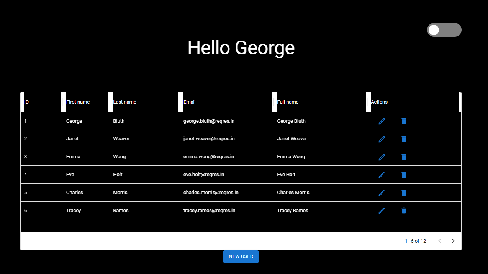

# User Management Platform

It is a frontend application to manage users.

Since the inicial page is possible alter between ligth and dark mode.  
As son as the user logged in application the user name and token are saved in local storage to keep the user authentication.  
With the User logged it is possible to add, exclude and delete users.  
The users list in paginated so it is possible to do a new request when change the page.

Requiriments: Node  
To run local: npm install + npm run dev  
To run test: npm run cy

## Stack: React + TypeScript + Vite + Context API + Material UI + cypress + eslint

